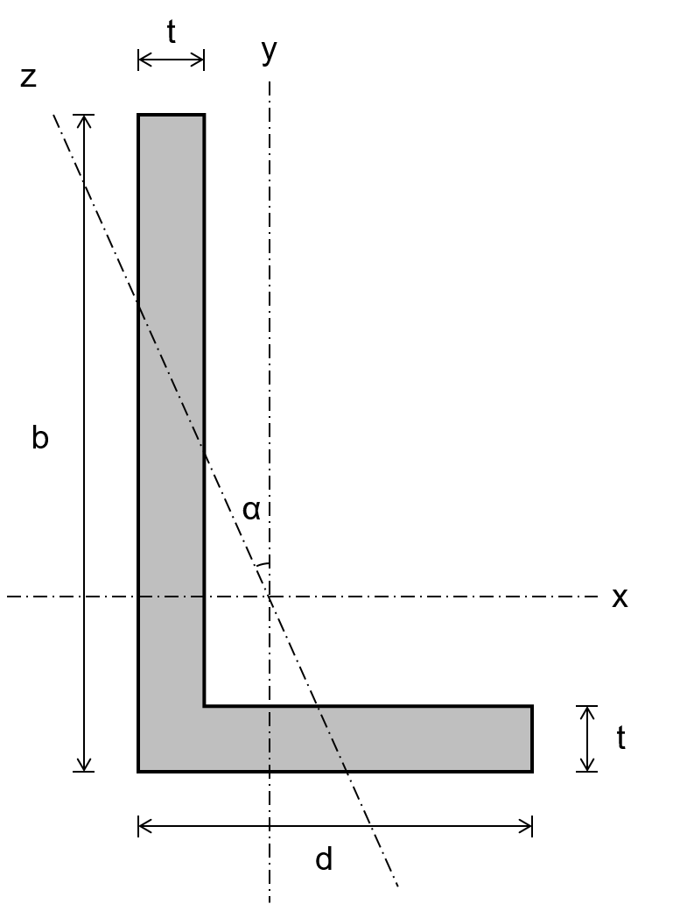
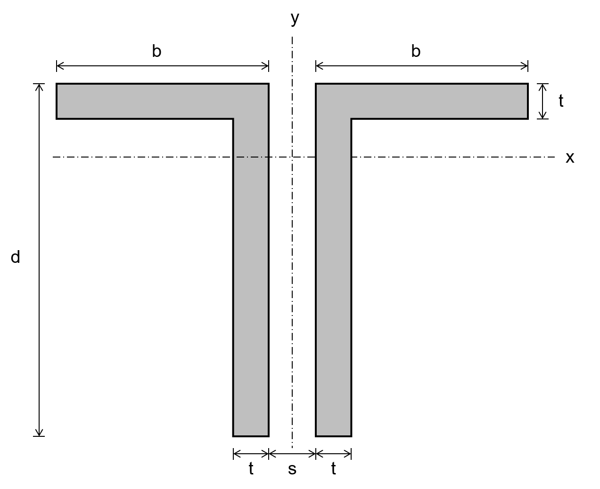

# Angle

# Double Angle
Note that the definitions of d and b are swapped from the Angle class to match the definitions in the [AISC Shapes Database](https://www.aisc.org/aisc/publications/steel-construction-manual/aisc-shapes-database-v160/).

